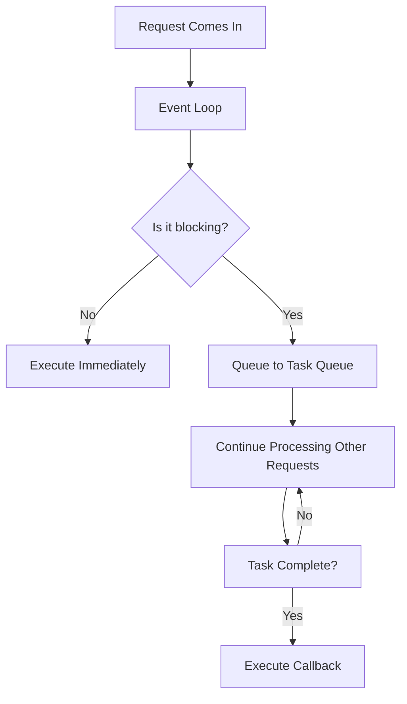

---

## **The Event Loop: Server Edition** 🔄

Before we dive in, remember: **Node.js is single-threaded** (one main thread), but it handles thousands of requests simultaneously. How? The Event Loop!

---

## **Real-World Server Analogy** 🍽️

Think of a restaurant:

```
Node.js Server = A Restaurant with 1 Chef (single-threaded)
Event Loop = The Kitchen Manager
Requests = Customers
Async Operations = Tasks that take time (cooking, cleaning)
```

### **Without Event Loop (Blocking):**
```
Customer 1: Orders pasta (takes 10 mins)
Chef: Cooks pasta (10 mins, ignores other customers)
Customer 2: Orders salad (waits 10 mins!)
Customer 3: Orders soup (waits 10 mins!)
```
❌ **Terrible!** Everyone waits!

### **With Event Loop (Non-Blocking):**
```
Customer 1: Orders pasta → Manager writes it down (done!)
Customer 2: Orders salad → Manager writes it down (done!)
Customer 3: Orders soup → Manager writes it down (done!)

Chef: Cooks all dishes efficiently, serves when ready
```
✅ **Amazing!** No one waits for the chef!

---

## **How This Works in Node.js**

### **Scenario: A Simple Web Server**

```javascript
const http = require('fs');
const fs = require('fs');

const server = http.createServer((req, res) => {
    
    // 1. FAST operation (synchronous)
    console.log('📨 Request received!');
    
    // 2. SLOW operation (asynchronous - non-blocking!)
    fs.readFile('huge-file.txt', (err, data) => {
        if (err) {
            res.end('Error!');
            return;
        }
        res.end(data); // Sends file to client
    });
    
    // 3. This runs IMMEDIATELY (doesn't wait for file!)
    console.log('🔄 File reading started...');
});

server.listen(3000);
```

**What happens when 1000 users visit at once?**

```
1. User 1 requests page → Event Loop starts reading file (non-blocking)
2. User 2 requests page → Event Loop starts reading file (non-blocking)
3. User 3 requests page → Event Loop starts reading file (non-blocking)
   ... (handles ALL 1000 requests instantly!)
4. Files finish reading → Event Loop sends responses back
```

---

## **The Event Loop Visualized in a Server** 🎯



---

## **Event Loop Phases (Server Context)** 📋

### **1. Timers Phase**
```javascript
setTimeout(() => {
    console.log('⏰ Timer done!');
}, 1000);
// Event Loop waits here, checking timer callbacks
```

### **2. Pending Callbacks**
```javascript
fs.readFile('file.txt', (err, data) => {
    console.log('📂 File read complete!');
});
// File reading complete? Event Loop processes it here
```

### **3. Idle/Prepare** (internal use)

### **4. Poll Phase** (MOST IMPORTANT FOR SERVERS!)
```javascript
const server = http.createServer((req, res) => {
    // THIS IS WHERE MOST SERVER CODE RUNS
    res.end('Hello!');
});

// Event Loop spends MOST time here, waiting for requests
```

### **5. Check Phase**
```javascript
setImmediate(() => {
    console.log('⚡ Immediate callback!');
});
// Runs after poll phase
```

### **6. Close Callbacks**
```javascript
server.on('close', () => {
    console.log('Server closed');
});
```

---

## **Real Server Examples**

### **Example 1: Non-Blocking Server** ✅

```javascript
const http = require('http');
const fs = require('fs');

const server = http.createServer((req, res) => {
    
    // Path: /fast - Immediately responds
    if (req.url === '/fast') {
        res.end('Fast response!');
        console.log('✅ Fast request handled');
    }
    
    // Path: /slow - Non-blocking file read
    else if (req.url === '/slow') {
        console.log('⏳ Slow request started...');
        
        // This doesn't block! Event Loop continues
        fs.readFile('large-file.txt', (err, data) => {
            console.log('✅ Slow request finished!');
            res.end(data);
        });
        
        console.log('🔄 Still running! (Not blocked)');
    }
});

server.listen(3000, () => {
    console.log('🚀 Server running on http://localhost:3000');
});
```

**Test it:**
1. Open browser to `http://localhost:3000/slow` (file loads slowly)
2. While it's loading, open `http://localhost:3000/fast` in another tab
3. The fast request responds immediately! (Not blocked by slow file)

---

### **Example 2: BLOCKING Server** ❌ (Don't do this!)

```javascript
const http = require('http');

const server = http.createServer((req, res) => {
    
    // THIS BLOCKS THE ENTIRE SERVER! 😱
    if (req.url === '/bad') {
        console.log('⏳ Blocking operation started...');
        
        // Synchronous loop - BLOCKS everything!
        let sum = 0;
        for (let i = 0; i < 10000000000; i++) {
            sum += i;
        }
        
        console.log('✅ Done blocking!');
        res.end('Done!');
    }
});

server.listen(3000);
```

**What happens?**
- User 1 visits `/bad` - Server freezes for 5 seconds
- User 2 visits `/fast` during this time - **They wait too!** (Server is frozen)
- **Terrible user experience!**

---

## **The Event Loop in Action: Multiple Requests**

```javascript
const http = require('http');
const fs = require('fs');

// Simulate 3 different tasks
const server = http.createServer((req, res) => {
    
    const timestamp = Date.now();
    
    // Task 1: Quick response
    if (req.url === '/quick') {
        res.end('Quick!');
        console.log(`⚡ Quick response: ${Date.now() - timestamp}ms`);
    }
    
    // Task 2: Database query (simulated with setTimeout)
    else if (req.url === '/db') {
        setTimeout(() => {
            res.end('DB data');
            console.log(`🗄️ Database response: ${Date.now() - timestamp}ms`);
        }, 2000);
        console.log('🗄️ DB query started (non-blocking)');
    }
    
    // Task 3: File read
    else if (req.url === '/file') {
        fs.readFile('large-file.txt', (err, data) => {
            res.end(data);
            console.log(`📂 File response: ${Date.now() - timestamp}ms`);
        });
        console.log('📂 File read started (non-blocking)');
    }
});

server.listen(3000);
```

**Test 1: Sequential Requests**
```
Request /quick → responds in 2ms
Request /db    → responds in 2002ms
Request /file  → responds in 500ms
```
✅ Good - each request handled independently!

**Test 2: Simultaneous Requests**
```
Time 0ms: /quick starts, /db starts, /file starts
Time 2ms: /quick responds (2ms)
Time 500ms: /file responds (500ms)
Time 2002ms: /db responds (2002ms)
```
✅ Event Loop handles ALL requests at once!

---

## **The Microtasks vs Macrotasks** 🔄

### **Microtasks (Priority Queue)**
```javascript
// process.nextTick - HIGHEST priority
process.nextTick(() => {
    console.log('🔥 1. process.nextTick');
});

// Promise.then - HIGH priority
Promise.resolve().then(() => {
    console.log('⚡ 2. Promise');
});

// setTimeout - LOW priority
setTimeout(() => {
    console.log('⏰ 3. setTimeout');
}, 0);

console.log('🚀 4. This runs first (synchronous)');
```

**Output:**
```
🚀 4. This runs first (synchronous)
🔥 1. process.nextTick
⚡ 2. Promise
⏰ 3. setTimeout
```

**In a Server Context:**
```javascript
const server = http.createServer((req, res) => {
    
    // Runs BEFORE any I/O callbacks
    process.nextTick(() => {
        console.log('📌 Next tick (high priority)');
    });
    
    // Runs before timers
    Promise.resolve().then(() => {
        console.log('🔵 Promise (medium priority)');
    });
    
    // Runs last
    setTimeout(() => {
        console.log('🟢 Timeout (low priority)');
    }, 0);
    
    res.end('Done!');
});
```

---

## **Server with Event Loop Visual Logging**

```javascript
const http = require('http');
const fs = require('fs');

const server = http.createServer((req, res) => {
    console.log('\n' + '='.repeat(40));
    console.log(`🔄 Request: ${req.url}`);
    console.log(`⏰ Time: ${new Date().toISOString()}`);
    console.log('='.repeat(40));
    
    // 1. Sync code (runs immediately)
    console.log('📌 1. Synchronous code');
    
    // 2. process.nextTick (microtask - runs after sync)
    process.nextTick(() => {
        console.log('📌 2. process.nextTick (microtask)');
    });
    
    // 3. Promise (microtask)
    Promise.resolve().then(() => {
        console.log('📌 3. Promise (microtask)');
    });
    
    // 4. setTimeout (macrotask)
    setTimeout(() => {
        console.log('📌 4. setTimeout (macrotask)');
    }, 0);
    
    // 5. setImmediate (macrotask - after I/O)
    setImmediate(() => {
        console.log('📌 5. setImmediate (macrotask)');
    });
    
    // 6. File operation (I/O - macrotask)
    fs.readFile('test.txt', (err, data) => {
        console.log('📌 6. fs.readFile callback (I/O macrotask)');
        res.end('Done!');
    });
    
    console.log('📌 Response sent (synchronous code continues)');
});

server.listen(3000, () => {
    console.log('🚀 Server running on http://localhost:3000');
    console.log('📝 Try visiting: http://localhost:3000/\n');
});
```

**Visit the server and see the order!**

---

## **The Event Loop Flow in a Real Server** 🎯

```
1. Server starts → Event Loop begins
2. Request arrives → Event Loop adds to queue
3. Event Loop checks: 
   - Any microtasks? (process.nextTick, Promises)
   - Any expired timers? (setTimeout, setInterval)
   - Any I/O operations? (files, network, DB)
4. Event Loop processes EVERYTHING asynchronously
5. Response is sent back to client
6. Event Loop continues waiting for more requests
```

---

## **Node.js vs Other Servers** 

| Server | Model | How It Handles Requests |
|--------|-------|------------------------|
| **Node.js** | Event-driven | One thread, handles thousands (Event Loop) |
| **Apache/PHP** | Process per request | 1 thread per request (thousands = thousands threads) |
| **Java/Tomcat** | Thread per request | 1 thread per request (memory heavy) |
| **Go** | Goroutines | Lightweight threads (good, but different) |

---

## **Real-World Impact: Why Event Loop Matters**

### **Scenario: E-commerce Checkout**
```javascript
app.post('/checkout', (req, res) => {
    
    // These run PARALLEL (non-blocking)
    const operations = [
        updateDatabase(req.body),      // 100ms
        processPayment(req.body),      // 300ms
        sendEmailConfirmation(req.body), // 50ms
        updateInventory(req.body)      // 80ms
    ];
    
    // Wait for ALL to finish
    Promise.all(operations).then(() => {
        res.json({ success: true });
    });
    
    // Total time: ~300ms (not 530ms!)
    // Event Loop handled everything efficiently!
});
```

---

## **Common Event Loop Pitfalls in Servers**

### **🚨 DON'T DO THIS: Blocking the Event Loop**

```javascript
// ❌ BAD - Blocks the entire server!
app.get('/bad', (req, res) => {
    // This loops for 5 seconds - SERVER FREEZES!
    let result = 0;
    for (let i = 0; i < 1e9; i++) {
        result += i;
    }
    res.send({ result });
});
```

### **✅ DO THIS: Non-Blocking Approach**

```javascript
// ✅ GOOD - Non-blocking
app.get('/good', (req, res) => {
    // Use async operations
    fs.readFile('data.json', (err, data) => {
        if (err) throw err;
        res.send(JSON.parse(data));
    });
});

// ✅ GOOD - Use worker threads for heavy CPU tasks
const { Worker } = require('worker_threads');
app.get('/heavy', (req, res) => {
    const worker = new Worker('./heavy-task.js');
    worker.on('message', (result) => {
        res.send({ result });
    });
});
```

---

## **Exercise: Build a Server and Observe the Event Loop**

Create `event-loop-server.js`:

```javascript
const http = require('http');
const fs = require('fs');

console.log('🔴 1. Server starting...');

let requestCount = 0;

const server = http.createServer((req, res) => {
    requestCount++;
    const requestId = requestCount;
    
    console.log(`\n🔵 Request #${requestId} received at ${req.url}`);
    console.log(`   Current time: ${new Date().toISOString()}`);
    
    // Simulate different operations
    if (req.url === '/') {
        res.end('Home page');
        console.log(`✅ Request #${requestId} completed (fast)`);
    }
    else if (req.url === '/slow-file') {
        console.log(`⏳ Request #${requestId} starting file read...`);
        
        // Simulates slow file read
        fs.readFile('large-file.txt', (err, data) => {
            if (err) {
                console.log(`❌ Request #${requestId} error:`, err.message);
                res.end('File not found');
                return;
            }
            console.log(`✅ Request #${requestId} file read completed`);
            res.end(data);
        });
        
        console.log(`🔄 Request #${requestId} is processing (non-blocking)`);
    }
    else if (req.url === '/timer') {
        console.log(`⏳ Request #${requestId} starting timer...`);
        
        setTimeout(() => {
            console.log(`✅ Request #${requestId} timer completed`);
            res.end('Timer done');
        }, 3000);
        
        console.log(`🔄 Request #${requestId} timer set (non-blocking)`);
    }
    else if (req.url === '/block') {
        console.log(`⏳ Request #${requestId} BLOCKING STARTED!`);
        
        // BLOCKING - DON'T DO THIS IN REAL APPS!
        let sum = 0;
        for (let i = 0; i < 1e8; i++) {
            sum += i;
        }
        
        console.log(`✅ Request #${requestId} BLOCKING COMPLETED`);
        res.end('Blocking done');
    }
    else {
        res.end('404');
    }
});

server.listen(3000, () => {
    console.log('🟢 2. Server listening on http://localhost:3000');
    console.log('📝 Try these URLs:');
    console.log('   - http://localhost:3000/');
    console.log('   - http://localhost:3000/slow-file');
    console.log('   - http://localhost:3000/timer');
    console.log('   - http://localhost:3000/block (WARNING: Blocks server!)');
    console.log('\n🔵 3. Event Loop is now running...\n');
});

// Track event loop health
setInterval(() => {
    console.log(`💚 Event Loop is alive! Requests handled: ${requestCount}`);
}, 5000);
```

**Try This Experiment:**
1. Open 3 browser tabs
2. Go to `/timer` in tab 1
3. Immediately go to `/` in tab 2
4. Notice how `/` responds immediately, even though `/timer` is waiting!
5. Try `/block` and see how it freezes everything

---

## **Event Loop Summary** 📝

| Concept | In Simple Terms | In Server Context |
|---------|----------------|-------------------|
| **Event Loop** | The manager that keeps things moving | Waits for requests and processes them asynchronously |
| **Non-blocking** | Doesn't wait for slow tasks | Can handle 1000s of requests simultaneously |
| **Callbacks** | "Do this when you're done" | Called when file reads, DB queries complete |
| **Microtasks** | High priority tasks | process.nextTick, Promises |
| **Macrotasks** | Lower priority tasks | setTimeout, setInterval, I/O |

---

## **Key Takeaways** 🎯

1. ✅ **Node.js is single-threaded** but uses Event Loop for concurrency
2. ✅ **Never block the Event Loop** in server code
3. ✅ **Use async operations** for I/O (files, network, DB)
4. ✅ **The Event Loop handles** thousands of concurrent requests
5. ✅ **Microtasks run before Macrotasks** (process.nextTick > Promises > timers)
